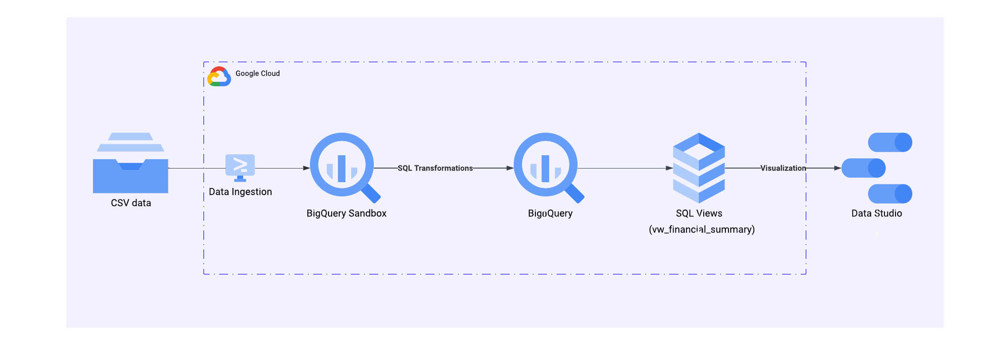
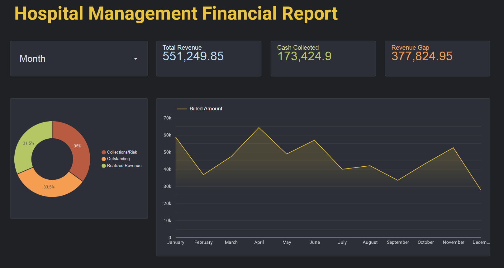

# Hospital Management ELT Pipeline using GCP
A complete End-to-End ELT Pipeline using Google Cloud Platform and Data Studio for Hospital Financial Analysis.
## Datasets
Source: [Hospital Management Dataset](https://www.kaggle.com/datasets/kanakbaghel/hospital-management-dataset)
- patients (50 rows, 10 cols): Patient demographics, contact details, registration info, and insurance data
- doctors (10 rows, 8 cols): Doctor profiles with specializations, experience, and contact information
- appointments (200 rows, 7 cols): Appointment dates, times, visit reasons, and statuses
- treatments (200 rows, 6 cols): Treatment types, descriptions, dates, and associated costs
- billing (200 rows, 7 cols): Billing amounts, payment methods, and status linked to treatments
## Tech Stack
- Google Cloud Platform
- Google Cloud Shell
- BigQueries
- Data Studio
- SQL
## Architecture

- **Data Ingestion:** Uploaded raw CSV files via Bash script (Cloud Shell) to the Landing Zone (BigQuery Sandbox)
- **ELT Pipeline:** Developed an ELT pipeline using SQL Transformations to process data within the Data Warehouse
- **SQL Views:** Built SQL views to prepare clean datasets for analytics
- **Visualization:** Delivered insights through an interactive dashboard in Data Studio
## Data Studio Dashboard
[Hospital Financial Summary Report](data_studio_dashboard/Hospital_Financial_Summary_Report.pdf)

## Project Structure
📁 `Hospital_Management_ELT_Pipeline/`
- 📁 `assets/` → Image
- 📁 `data/` →  Raw Dataset
- 📁 `data_studio_dashboard/` →  Final Dashboard Report (PDF)
- 📁 `sql_script/` →  BigQuery SQL scripts
- README.md
